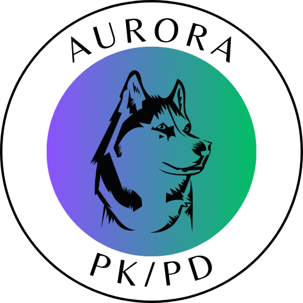

# Aurora PK/PD 

### Open Web App for Pharmcological Modeling and Analysis

**Aurora PK/PD** is an open-source Python web app implemented using 
the [streamlit](https://streamlit.io/) framework, offering users a versatile and accessible pharmacokinetics and pharmacodynamics modeling and analysis platform particularly suited to rapid prototyping and exploratory analysis.

You can access the app running in the Streamlit cloud at 

**[aurora-pkpd.streamlit.app](https://aurora-pkpd.streamlit.app/)**

------

# License

This project is licensed under the BSD 2-Clause License - see the [LICENSE](LICENSE) file for details

------

# Contact

 * **Issues** :bug: : Please open a [GitHub Issue](https://github.com/Borealis-BioModeling/aurora-pkpd/issues) to report any problems/bugs with the code or its execution, or to make any feature requests.

 * **Discussions** :grey_question: : If you have questions, suggestions, or want to discuss anything else related to the project, feel free to use the [Discussions](https://github.com/Borealis-BioModeling/aurora-pkpd/discussions) board.

------

# Supporting

I'm very happy that you've chosen to use __Aurora PKPD__. This is a project that I'm developing and maintaining on my own time and without external grant funding. If you've found it helpful, here are a few ways you can support its ongoing development:

* **Star** :star: : Show your support by starring the [Aurora PK/PD GitHub repository](https://github.com/Borealis-BioModeling/aurora-pkpd). It helps increase the project's visibility and lets others know it's useful. It also benefits my motivation to continue improving the app!
* **Share** :mega: : Sharing `Aurora PK/PD` on your social media, forums, or with your network is another great way to support the project. It helps more people discover the app, which in turn motivates me to keep developing!
* **Cite** :books: : Citing or mentioning this software in your work, publications, or projects is another valuable way to support it. It helps spread the word and acknowledges the effort put into its development, which is greatly appreciated!
* **Sponsor** :dollar: : Even small financial contributions, such as spotting me the cost of a tea through Ko-fi so I can get my caffeine fix, can make a big difference! Every little bit can help me continue developing this and other open-source projects. For more details on sponsoring this project see [SPONSORING](SPONSORING.md).

-----
